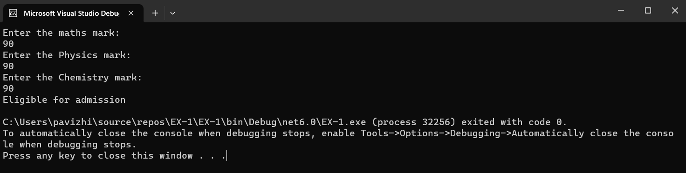

# Eligibility-for-Admission

## Aim:
To write C# program to find the eligibility for admission to an engineering course

## Algorithnm:
## Step 1:
Create a new Class.

## Step 2:
Create variable of respective data types to store marks.

## Step 3:
Calculate the total for all the three subjects and store it.

## Step 4:
Calculate the total for two subjects and store it.

## Step 5:

Marks in maths >= 65 & Marks in physics >=55 & Marks in chemistry >=50
Total marks in all three subjects >= 180 or total in maths and physics >= 140

## Step 6:
Using Nested if check whether the person is eligible or not for admission based on given conditions.

## Step 7:
Print whether the person is eligible or not with the given inputs.

## Step 7:
End the Program.


## Program:
```
using System;
public class program
{
    public static void Main(string[] args)
    {
        int m, p, c;
        Console.WriteLine("Enter the maths mark:");
        m = Convert.ToInt32(Console.ReadLine());
        Console.WriteLine("Enter the Physics mark:");
        p = Convert.ToInt32(Console.ReadLine());
        Console.WriteLine("Enter the Chemistry mark:");
        c = Convert.ToInt32(Console.ReadLine());
        int total = m + p + c;
        int total2 = m + p;
        if(m>=65&&p>=55&&c>=50)
        {
            if (total >= 180 || total2 >= 140)
                Console.WriteLine("Eligible for admission");
            else
                Console.WriteLine("Not eligible for admission");            
        }
        else
            Console.WriteLine("Not eligible");


    }
}


```
## Output:



## Result:
A C# program is written to find the eligibility for admission to an engineering course and has been successfully executed.
